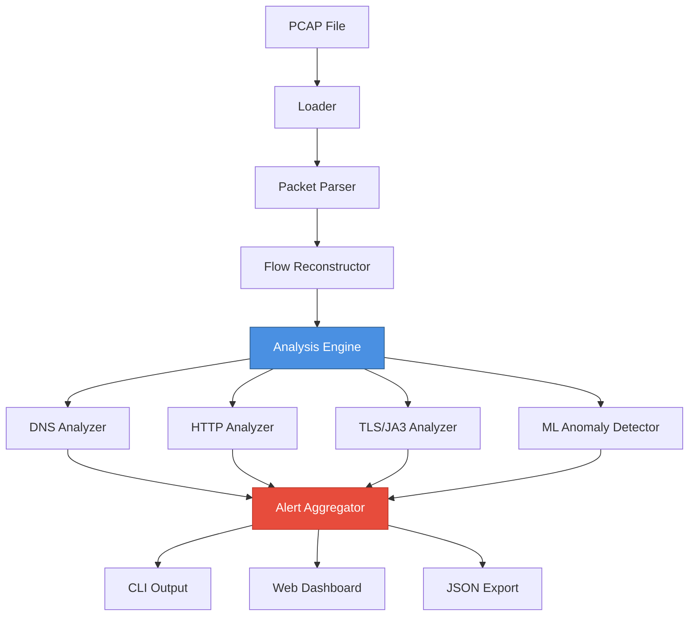

# 🧠 CapXray – Advanced PCAP Analysis & Network Forensics

<p align="center">
  
  
  
  
</p>

<p align="center">
  <strong>High-performance network traffic analysis and threat detection platform for SOC analysts, DFIR specialists, and security researchers.</strong>
</p>

---

## ✨ Highlights

**CapXray** combines advanced packet analysis, machine learning-based anomaly detection, and real-time visualization to deliver unparalleled network forensics capabilities. From flow reconstruction to JA3 fingerprinting, CapXray provides the tools needed for modern threat hunting and incident response.

---

## 🚀 Key Features

### 🔬 Deep Traffic Analysis

- **⚡ High-Performance Engine**: Concurrent flow processing with Go worker pools
- **🔄 Smart Flow Reconstruction**: 5-tuple session tracking (TCP/UDP/ICMP)
- **📊 Protocol Dissection**: Deep inspection of DNS, HTTP, TLS, and more

### 🛡️ Advanced Threat Detection

#### Protocol Analysis

- **DNS**: Entropy-based tunneling detection, long domain flagging, NXDOMAIN abuse tracking
- **HTTP**: Suspicious User-Agent identification, cleartext credential detection
- **TLS**: Full JA3 fingerprinting with malicious hash database (Trickbot, Dridex, Metasploit, Cobalt Strike)

#### ML-Powered Anomaly Detection (v1.1)

- **C2 Beaconing**: Statistical analysis of traffic periodicity (coefficient of variation < 0.15)
- **Data Exfiltration**: High-volume upload pattern detection (>10MB sustained)
- **Packet Anomalies**: Identification of unusual packet sizes and distributions

### 🎨 Premium User Experience

- **CLI Excellence**: Colorized output, ASCII banners, structured tables
- **🌐 Real-Time Dashboard**: Modern web UI with live updates (v1.1)
- **📈 Live Visualization**: Protocol distribution, alerts, flow metrics

### 🔗 Enterprise Integration

- **JSON/CSV Export**: SIEM-ready output for Splunk, ELK, QRadar
- **YAML Rules**: Flexible detection threshold configuration
- **REST API**: Programmatic access to all analysis data

---

## 🛠 Installation

### Prerequisites

- **Go**: 1.22 or higher
- **libpcap**: Development headers (`libpcap-dev` on Debian/Ubuntu)

### Quick Start

```bash
# Clone repository
git clone https://github.com/ismailtsdln/CapXray.git
cd CapXray

# Build
go build -o capxray ./cmd/capxray

# Verify installation
./capxray --help
```

---

## 📖 Usage Guide

### Basic Commands

#### 1. Quick Scan

Perform comprehensive PCAP analysis with all detectors enabled.

```bash
capxray scan capture.pcap
```

**Output:**

```
[*] Scanning capture.pcap...
[+] Scan complete. Total flows: 1234, Alerts: 5
```

#### 2. Network Statistics

View protocol distribution and traffic metrics.

```bash
capxray stats capture.pcap
```

#### 3. Flow Listing

Display reconstructed network sessions.

```bash
capxray flows capture.pcap
```

#### 4. Threat Detection

Run all detection engines with custom rules.

```bash
capxray detect capture.pcap --rules rules/custom.yaml
```

**Alert Types:**

- `DNS-Long-Domain` - Potential DNS tunneling
- `DNS-High-Entropy` - Encoded data in DNS queries
- `Suspicious-User-Agent` - Known malicious tools
- `Suspicious-JA3` - Malware TLS fingerprint
- `ML-Beaconing` - C2 communication pattern
- `ML-Data-Exfiltration` - Large data transfer

#### 5. Data Export

Export analysis results for further processing.

```bash
capxray export capture.pcap --format json > report.json
```

#### 6. Web Dashboard (v1.1)

Start real-time visualization server.

```bash
capxray server capture.pcap --port 8080
```

Then navigate to **`http://localhost:8080`** in your browser.

**Dashboard Features:**

- 📊 Real-time statistics cards
- 🚨 Live alert feed with severity indicators
- 📈 Protocol distribution charts
- 🌊 Network flow table
- ⚡ Auto-refresh (3-second intervals)

---

## ⚙️ Configuration

CapXray uses YAML-based rules for fine-tuning detection sensitivity.

### Default Rules (`rules/default.yaml`)

```yaml
dns:
  max_domain_length: 60      # Flag domains exceeding this length
  entropy_threshold: 4.5     # Shannon entropy for tunneling detection

beaconing:
  min_hits: 10               # Minimum packets for beaconing detection
  max_jitter: 5s             # Maximum timing variance

http:
  suspicious_uas:
    - "nmap"
    - "sqlmap"
    - "gobuster"
    - "dirb"
```

### Custom Rules

Create your own detection profile:

```bash
cp rules/default.yaml rules/custom.yaml
# Edit rules/custom.yaml
capxray detect traffic.pcap --rules rules/custom.yaml
```

---

## 🏗 Architecture



### Component Overview

| Component | Responsibility |
|-----------|---------------|
| **PCAP Loader** | Reads offline captures using `gopacket` |
| **Flow Reconstructor** | Builds 5-tuple sessions from packets |
| **Analysis Engine** | Orchestrates analyzers with worker pools |
| **Protocol Analyzers** | DNS, HTTP, TLS deep inspection |
| **ML Detector** | Statistical anomaly identification |
| **API Server** | REST endpoints for web dashboard |

---

## 🎯 Use Cases

### SOC Operations

- Real-time threat hunting in captured traffic
- Malware C2 communication detection
- DNS tunneling and exfiltration identification

### Digital Forensics

- Post-incident network traffic analysis
- JA3 fingerprint correlation with threat intelligence
- Timeline reconstruction from flow data

### Security Research

- Malware traffic behavior analysis
- Protocol anomaly discovery
- Detection rule development and tuning

### Penetration Testing

- Red team tool detection (Metasploit, Cobalt Strike)
- Blue team capability validation
- Detection gap identification

---

## 📊 Output Examples

### CLI Alert Output

```
Type                    Severity  Source           Destination      Description
ML-Beaconing           High      192.168.1.100    203.0.113.45     Regular interval traffic pattern detected
Suspicious-JA3         High      10.0.0.50        1.2.3.4          JA3: ada70206e40642a3e4461f35503241d5 (Cobalt Strike)
DNS-High-Entropy       Medium    192.168.1.45     8.8.8.8          High entropy: aGVsbG8ud29ybGQ.example.com
```

### JSON Export Format

```json
{
  "summary": {
    "total_flows": 1234,
    "total_alerts": 5,
    "analyzer_count": 7
  },
  "alerts": [
    {
      "type": "Suspicious-JA3",
      "severity": "High",
      "flow_id": "192.168.1.50:49152->1.2.3.4:443[TCP]",
      "description": "Suspicious JA3 fingerprint detected",
      "indicators": ["ada70206e40642a3e4461f35503241d5"]
    }
  ],
  "flows": [...]
}
```

---

## 🧪 Testing

```bash
# Format code
go fmt ./...

# Run linter
go vet ./...

# Build for production
go build -ldflags="-s -w" -o capxray ./cmd/capxray
```

---

## 🤝 Contributing

Contributions are welcome! Please follow these guidelines:

1. **Fork** the repository
2. **Create** a feature branch (`git checkout -b feature/AmazingFeature`)
3. **Commit** your changes (`git commit -m 'Add AmazingFeature'`)
4. **Push** to the branch (`git push origin feature/AmazingFeature`)
5. **Open** a Pull Request

### Development Setup

```bash
git clone https://github.com/ismailtsdln/CapXray.git
cd CapXray
go mod download
go build ./cmd/capxray
```

---

## 📝 License

This project is licensed under the **MIT License** - see the [LICENSE](LICENSE) file for details.

---

## 👤 Author

**Ismail Tasdelen**  
🔗 GitHub: [@ismailtsdln](https://github.com/ismailtsdln)  
📧 Email: [Contact via GitHub](https://github.com/ismailtsdln)  
🌐 Project: [CapXray](https://github.com/ismailtsdln/CapXray)

---

## 🙏 Acknowledgments

- **gopacket** - Google's packet processing library
- **cobra** - CLI framework by spf13
- **open-ch/ja3** - JA3 fingerprinting implementation
- **Community** - Security researchers and contributors

---

## 📚 Related Projects

- [Wireshark](https://www.wireshark.org/) - Network protocol analyzer
- [Zeek](https://zeek.org/) - Network security monitor
- [Suricata](https://suricata.io/) - IDS/IPS engine
- [Moloch](https://github.com/aol/moloch) - Large scale packet capture

---

<p align="center">Made with ❤️ for the security community</p>
