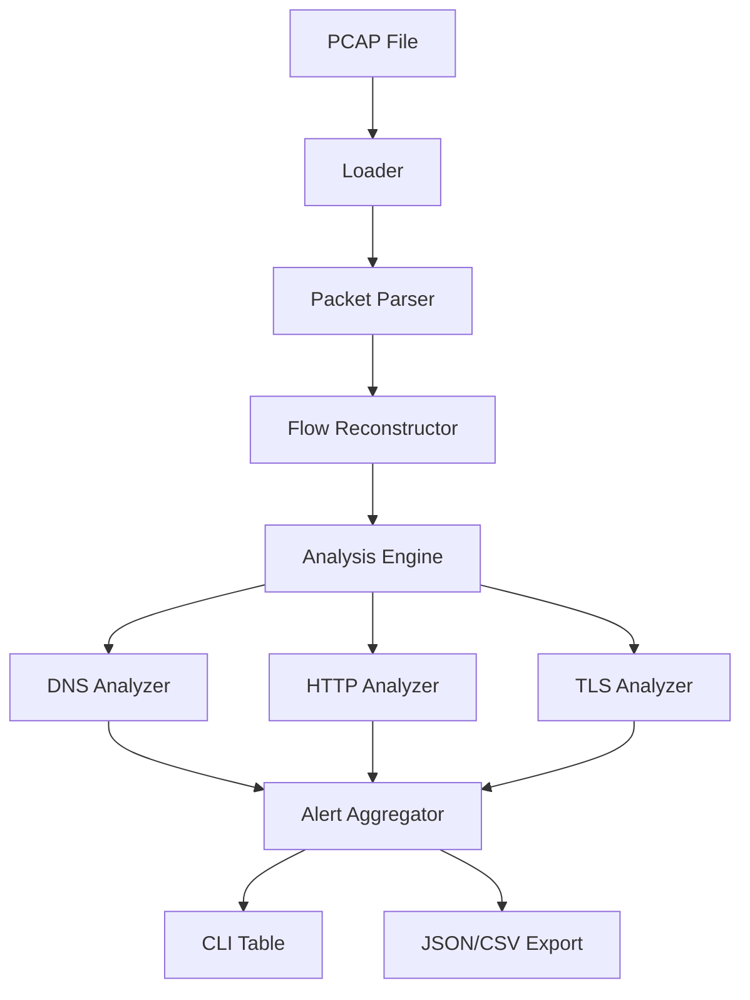

# 🧠 CapXray – Advanced PCAP Analysis & Network Forensics

<p align="center">
  
  
  
</p>

**CapXray** is a high-performance, security-focused PCAP inspection and network forensics tool designed for SOC analysts, DFIR specialists, and security researchers. It provides deep visibility into network traffic through flow reconstruction, protocol dissection, and heuristic-based threat detection.

---

## 🚀 Key Features

- **⚡ High-Performance Core**: Built with Go 1.22+, utilizing goroutines and worker pools for concurrent flow processing.
- **🔄 Flow Reconstruction**: Intelligent 5-tuple session tracking for TCP, UDP, and ICMP protocols.
- **🔍 Protocol Analysis**:
  - **DNS**: Entropy-based tunneling detection, long domain analysis, and NXDOMAIN abuse tracking.
  - **HTTP**: Suspicious User-Agent detection and cleartext credential harvesting.
  - **TLS**: JA3 fingerprinting readiness and certificate metadata extraction.
- **🧠 Threat Detection**: Real-time identification of C2 beaconing, port scanning, and DNS exfiltration.
- **🎨 Premium CLI UX**: Dynamic ASCII banners, colorized output, and structured data tables for immediate situational awareness.
- **📊 SIEM Integration**: Native JSON export capability compatible with Splunk, ELK, and SOAR platforms.

---

## 🛠 Installation

### Prerequisites

- Go 1.22 or higher
- `libpcap` development headers

### Build from Source

```bash
git clone https://github.com/ismailtsdln/CapXray.git
cd CapXray
go build -o capxray ./cmd/capxray
```

---

## 📖 Usage Guide

CapXray is designed with a CLI-first philosophy. Commands are grouped by analysis type.

### 1. General Scan

Perform a high-level inspection of a PCAP file.

```bash
capxray scan analysis.pcap
```

### 2. Network Statistics

Get a breakdown of protocols, top talkers, and flow counts.

```bash
capxray stats analysis.pcap
```

### 3. Session/Flow Reconstruction

Drill down into specific reconstructed network sessions.

```bash
capxray flows analysis.pcap
```

### 4. Threat Detection

Run the heuristic engine against the traffic using custom or default rules.

```bash
capxray detect analysis.pcap --rules rules/default.yaml
```

### 5. Automated Data Export

Export full analysis results for SIEM ingestion.

```bash
capxray export analysis.pcap --format json > report.json
```

---

## ⚙️ Configuration & Rules

CapXray uses a YAML-based rule system to define detection thresholds. You can fine-tune these in `rules/default.yaml`:

```yaml
dns:
  max_domain_length: 60      # Flag domains longer than this
  entropy_threshold: 4.5     # Threshold for Shannon entropy (tunneling)
beaconing:
  min_hits: 10               # Minimum packets to flag as beacon
  max_jitter: 5s             # Allowed time variance between beacons
http:
  suspicious_uas:            # Blacklisted User-Agents
    - "nmap"
    - "sqlmap"
    - "gobuster"
```

---

## 🏗 Architecture



---

## 🤝 Contributing

We welcome contributions! Please follow these steps:

1. Fork the repository.
2. Create a feature branch (`git checkout -b feature/AmazingFeature`).
3. Commit your changes (`git commit -m 'Add some AmazingFeature'`).
4. Push to the branch (`git push origin feature/AmazingFeature`).
5. Open a Pull Request.

---

## 📝 License

Distributed under the MIT License. See `LICENSE` for more information.

---

## 👤 Author

**Ismail Tasdelen** - [@ismailtsdln](https://github.com/ismailtsdln)

Project Link: [https://github.com/ismailtsdln/CapXray](https://github.com/ismailtsdln/CapXray)
